# Práctica Final

## Descripción
En este archivo tipo README.md se incluye la documentación de la práctica final
de Integración Contínua en el Desarrollo Ágil, con la realización de los cambios pedidos
sobre el proyecto de la práctica 5.

## Índice
- [Práctica Final](#práctica-final)
  - [Trabajo "stage"](#trabajo-stage)
  - [Creación Milestone](#creación-milestone)
  - [REQ-1: Votos a 0](#req-1-votos-a-0)
  - [REQ-2: Ver Votos](#req-2-ver-votos)


## Trabajo "stage"
En primer lugar, se añade al workflow un trabajo "stage" para desplegar la aplicación en un entorno de pre-producción.
En este caso llamado "baloncesto-pre-jmfando".
    
```yaml
stage:
needs: qa
runs-on: ubuntu-latest
if: github.ref == 'refs/heads/main'
steps:
- name: Descargar repositorio
  uses: actions/checkout@v3
- name: Crear el archivo .war
  run: |
    mvn package -DskipTests=true
- name: Desplegar en Azure
  uses: Azure/webapps-deploy@v2
  with:
    app-name: baloncesto-pre-jmfando
    publish-profile: ${{ secrets.AZURE_WEBAPP_PUBLISH_PROFILE_PRE }}
    package: target/*.war
```

Este trabajo será prácticamente igual que el de deploy, pero no será necesaria la 
aprovación manual para desplegar en pre-producción. 

Ahora le añadimos al job "deploy" que
espere a que el job "stage" termine para poder ejecutarse. Esto tiene sentido ya que si hay algún 
error en pre-producción, no tendría sentido desplegar en producción.

```yaml
  deploy:
    needs: stage
    runs-on: ubuntu-latest
```

## Creación Milestone

Se ha creado un Milestone llamado "Práctica Final" para poder asignar las issues requeridas
en la práctica.


También se añaden las issues al proyecto "Baloncesto" para llevar el control de las tareas.


## REQ-1: Votos a 0

Para realizar esta tarea, junto con la mejora de la calidad del código (QA) y la PU, se ha 
creado una nueva rama llamada "feat/REQ-1-Votos-a-0" para realizar los cambios.


Para realizar el reseteo de votos, actualizamos la clase ModeloDatos.java añadiendo una sentencia
SQL que actualice los votos a 0.

```java
    public void resetVotos(){
        try {
            set = con.createStatement();
            set.executeUpdate("UPDATE Jugadores SET votos = 0");
            rs.close();
            set.close();
        } catch (Exception e) {
            // No modifica la tabla
            logger.info("No modifica la tabla");
            logger.info("El error es: " + e.getMessage());
        }
    }
```

En el archivo index.html, añadimos un botón para realizar el reseteo de votos.

```html
    <form action="resetVotos" method="post">
        <input type="submit" value="Resetear Votos">
    </form>
```

Y conectamos el servlet en el archivo web.xml.

```xml
    <servlet>
        <servlet-name>ResetVotos</servlet-name>
        <servlet-class>es.iespuertodelacruz.jmfranqueado.baloncesto.controlador.ResetVotos</servlet-class>
    </servlet>
    <servlet-mapping>
        <servlet-name>ResetVotos</servlet-name>
        <url-pattern>/resetVotos</url-pattern>
    </servlet-mapping>
```
Vemos que el botón aparece en la página principal de la aplicación.

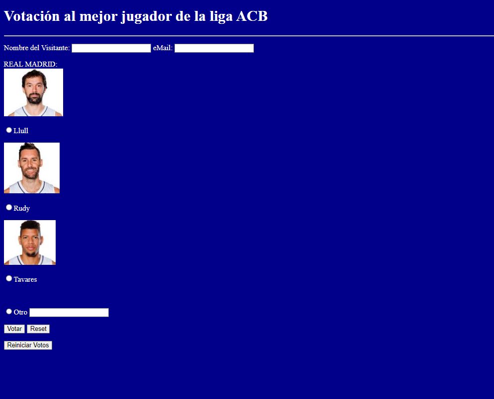

Tras pulsar el botón comprobamos que se han reseteado los votos correctamente.

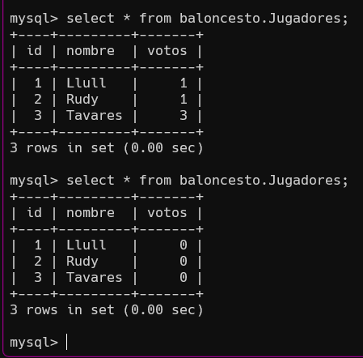

Con respecto a la prueba unitaria, he modificado el archivo ModeloDatosTest.java añadiendo
una nueva consulta a la hora de actualizar el voto, obteniendo el voto actual y devolviéndolo, y hacemos un Mock de 
esa clase en el test, para que simular la respuesta retornando el valor siguiente.

```java
public int actualizarJugador(String nombre) {
    try {
        set = con.createStatement();
        set.executeUpdate("UPDATE Jugadores SET votos = votos + 1 WHERE nombre " + " LIKE '%" + nombre + "%'");
        rs = set.executeQuery("SELECT * FROM Jugadores WHERE nombre LIKE '%" + nombre + "%'");
        int votos = rs.getInt("votos");
        rs.close();
        set.close();
        return votos;
    } catch (Exception e) {
        // No modifica la tabla
        logger.info("No modifica la tabla");
        logger.info(ERROR + e.getMessage());
    }
    return 0;
}

@Test
public void testActualizarJugador() {
        logger.info("Prueba de actualizarJugador");
        ModeloDatos modeloDatosMock = Mockito.mock(ModeloDatos.class);
        String jugador = "Rudy";
        int votosAntes = 5;
        Mockito.when(modeloDatosMock.actualizarJugador(jugador)).thenReturn(votosAntes + 1);
        assertEquals(votosAntes + 1, modeloDatosMock.actualizarJugador(jugador));
}
```

Tras realizar el commit, en el job "build" comprobamos que los 2 tests pasan correctamente.

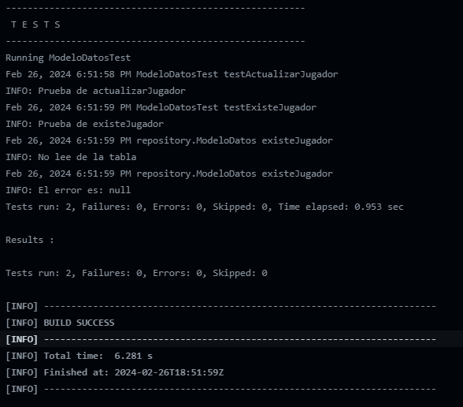

Ahora realizamos el merge de la rama "feat/REQ-1-Votos-a-0" a "main" y comprobamos que el despliegue funciona correctamente.


Vemos que se ha desplegado correctamente en pre-producción. Revisamos que esté todo bien y aprobamos el despliegue en producción.

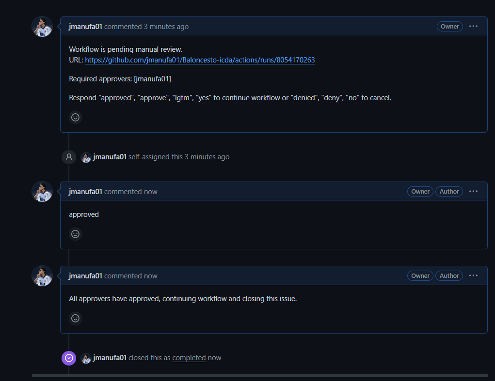

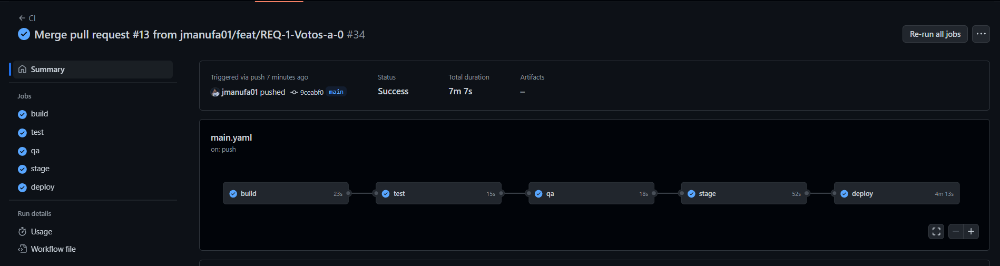

Una vez finalizado el primer requerimiento, actualizamos las tareas en el tablero, cerrando las tareas finalizadas. Quedando así el
milestone:

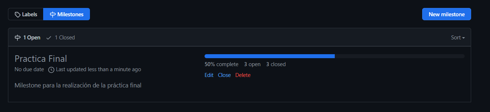

## REQ-2: Ver Votos

El resto de requerimientos lo haremos en otra rama llamada "feat/REQ-2-Ver-Votos".

En primer lugar, vamos a crear una clase modelo que utilizaremos para mapear los datos de la consulta SQL a una clase, 
de esta forma, nos crearemos una lista de jugadores y los incluiremos en el archivo .jsp.

```java
public class Jugador {
    private int id;
    private String nombre;
    private int votos;

    public Jugador(int id, String nombre, int votos) {
        this.id = id;
        this.nombre = nombre;
        this.votos = votos;
    }

    public int getId() {
        return id;
    }

    public void setId(int id) {
        this.id = id;
    }

    public String getNombre() {
        return nombre;
    }

    public void setNombre(String nombre) {
        this.nombre = nombre;
    }

    public int getVotos() {
        return votos;
    }

    public void setVotos(int votos) {
        this.votos = votos;
    }
}
```
Y creamos la función obtenerJugadores() en la clase ModeloDatos.java que nos devolverá una lista de jugadores.

```java
    public List<Jugador> obtenerJugadores() {
        try {
            set = con.createStatement();
            rs = set.executeQuery("SELECT * FROM Jugadores");
            List<Jugador> jugadores = new ArrayList<>();
            while (rs.next()) {
                int id = rs.getInt("id");
                String nombre = rs.getString("nombre");
                int votos = rs.getInt("votos");
                Jugador jugador = new Jugador(id, nombre, votos);
                jugadores.add(jugador);
            }
            rs.close();
            set.close();
            return jugadores;
        } catch (Exception e) {
            // No lee de la tabla
            logger.info("No lee de la tabla");
            logger.info(ERROR + e.getMessage());
        }
        return new ArrayList<>();
    }
```

Tras definir la función en el repositorio, creamos un nuevo servlet llamado "VerVotos" que incluirá la lista de jugadores en el archivo .jsp.

```java
    @Override
    public void service(HttpServletRequest req, HttpServletResponse res) throws ServletException, IOException {
        try {
            bd.resetVotos();
            res.sendRedirect(res.encodeRedirectURL("index.html"));
            logger.info("Votos reseteados");
        }catch (Exception e){
            logger.info(ERROR + e.getMessage());
        }
    }
```

Una vez hecho esto, crearemos un nuevo archivo llamado "VerVotos.jsp", que mediante la librería JSTL, 
nos permitirá incluir código HTML junto con código Java.

1. Añadimos la librería JSTL en el archivo pom.xml.

```xml
        <dependency>
            <groupId>jstl</groupId>
            <artifactId>jstl</artifactId>
            <version>1.2</version>
        </dependency>
```

2. Creamos el archivo "VerVotos.jsp" en la carpeta "webapp" y le añadimos el código para mostrar los votos.

```html
    <ul>
        <ul>
            <c:forEach var="item" items="${jugadores}">
                <li>
                    <span class="voto">${item.nombre} - ${item.votos}</span>
                </li>
            </c:forEach>
        </ul>
    </ul>
```

Si vamos a la página "Ver Votos" de la aplicación, vemos que se muestran los votos de los jugadores.

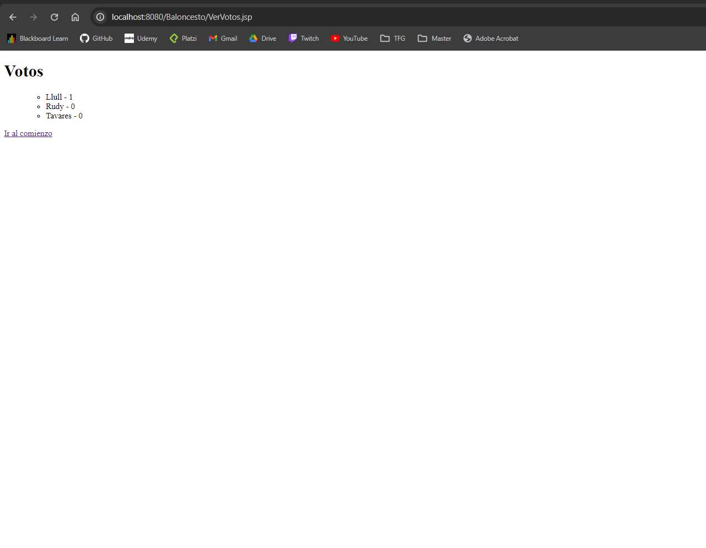

Por último, creamos las pruebas funcionales PF-A y PF-B, que mediante PhantomJS, pulsarán los botones de la aplicación buscándolos por id y comprobarán que se han reseteado los votos y que se muestran correctamente.

```java
    @Test
    void verVotosACeroTest()
            {
            DesiredCapabilities caps = new DesiredCapabilities();
            caps.setJavascriptEnabled(true);
            caps.setCapability(PhantomJSDriverService.PHANTOMJS_EXECUTABLE_PATH_PROPERTY,"/usr/bin/phantomjs");
            caps.setCapability(PhantomJSDriverService.PHANTOMJS_CLI_ARGS, new
            String[] {"--web-security=no", "--ignore-ssl-errors=yes"});
            driver = new PhantomJSDriver(caps);
            driver.navigate().to("http://localhost:8080/Baloncesto");
            driver.findElement(By.id("votos-a-cero-button")).click();
            driver.findElement(By.id("ver-votos-button")).click();
            driver.findElements(By.className("voto")).forEach(voto -> assertEquals("0", voto.getText().split("-")[1].trim()));
            }

    @Test
    void votarOtroTest() {
          DesiredCapabilities caps = new DesiredCapabilities();
          caps.setJavascriptEnabled(true);
          caps.setCapability(PhantomJSDriverService.PHANTOMJS_EXECUTABLE_PATH_PROPERTY,"/usr/bin/phantomjs");
          caps.setCapability(PhantomJSDriverService.PHANTOMJS_CLI_ARGS, new
          String[] {"--web-security=no", "--ignore-ssl-errors=yes"});
          driver = new PhantomJSDriver(caps);
          driver.navigate().to("http://localhost:8080/Baloncesto");
          driver.findElement(By.id("otro-input")).click();
          driver.findElement(By.name("txtOtros")).sendKeys("Pau Gasol");
          driver.findElement(By.name("B1")).click();
          driver.findElement(By.id("enlace-home")).click();
          driver.findElement(By.id("ver-votos-button")).click();
          driver.findElements(By.className("voto")).forEach(voto -> {
              String[] votoSplit = voto.getText().split("-");
              if (votoSplit[0].contains("Pau Gasol")) {
              assertEquals("1", votoSplit[1].trim());
              }
          });
    }
```

Finalmente, si accedemos al los jobs de GitHub, comprobamos que las pruebas pasan correctamente.

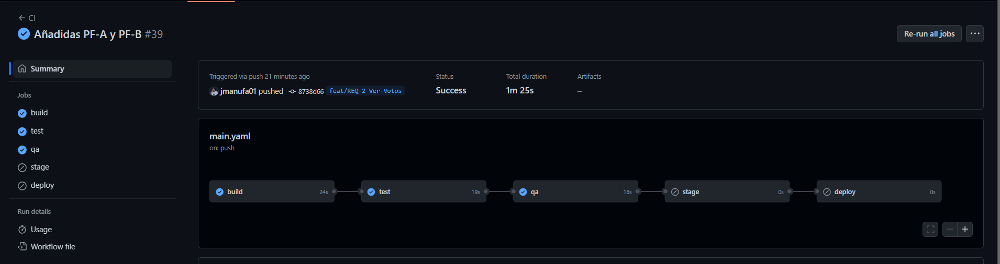

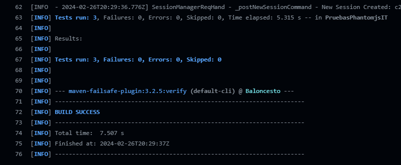

Para concluir con la práctica, mergeamos la rama "feat/REQ-2-Ver-Votos" a "main" y comprobamos que el despliegue funciona correctamente. Tras esto, cerramos las tareas en el tablero y finalizamos el milestone.

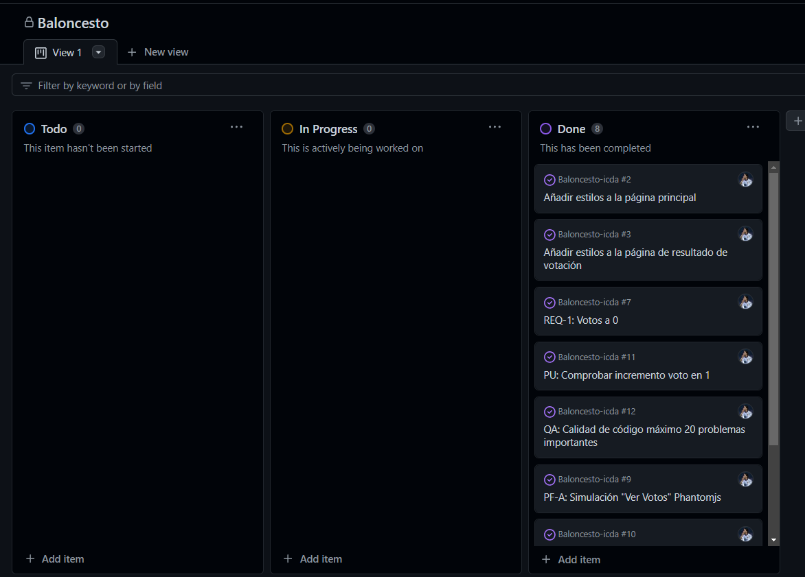

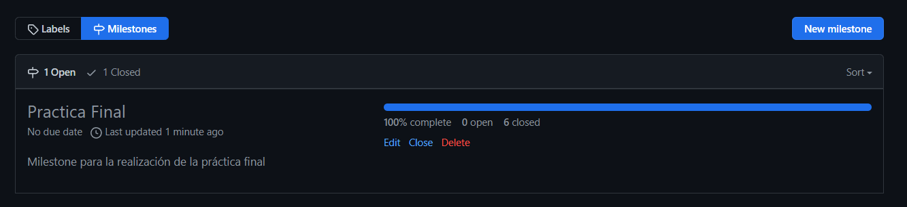