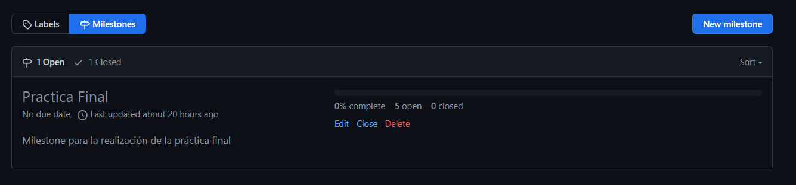
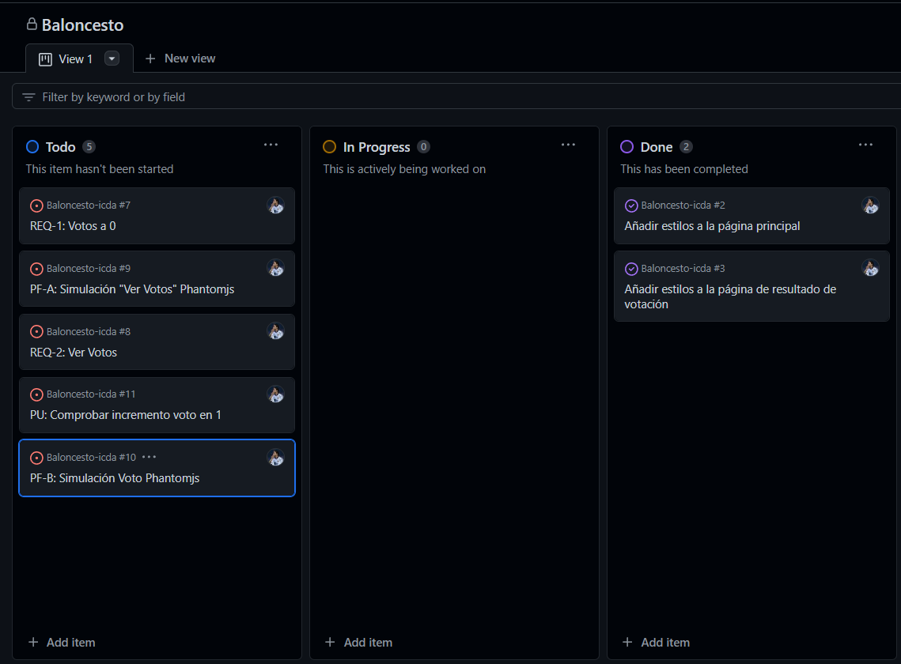
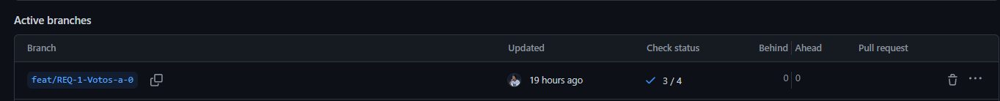

# Práctica Final

## Descripción
En este archivo tipo README.md se incluye la documentación de la práctica final
de Integración Contínua en el Desarrollo Ágil, con la realización de los cambios pedidos
sobre el proyecto de la práctica 5.

## Índice
- [Práctica Final](#práctica-final)
    - [Trabajo "stage"](#trabajo-stage)


## Trabajo "stage"
En primer lugar, se añade al workflow un trabajo "stage" para desplegar la aplicación en un entorno de pre-producción.
En este caso llamado "baloncesto-pre-jmfando".
    
```yaml
stage:
needs: qa
runs-on: ubuntu-latest
if: github.ref == 'refs/heads/main'
steps:
- name: Descargar repositorio
  uses: actions/checkout@v3
- name: Crear el archivo .war
  run: |
    mvn package -DskipTests=true
- name: Desplegar en Azure
  uses: Azure/webapps-deploy@v2
  with:
    app-name: baloncesto-pre-jmfando
    publish-profile: ${{ secrets.AZURE_WEBAPP_PUBLISH_PROFILE_PRE }}
    package: target/*.war
```

Este trabajo será prácticamente igual que el de deploy, pero no será necesaria la 
aprovación manual para desplegar en pre-producción.

## Creación Milestone

Se ha creado un Milestone llamado "Práctica Final" para poder asignar las issues requeridas
en la práctica.



También se añaden las issues al proyecto "Baloncesto" para llevar el control de las tareas.



## REQ-1: Votos a 0

Para realizar esta tarea, junto con la mejora de la calidad del código (QA) y la PU, se ha 
creado una nueva rama llamada "feat/REQ-1-Votos-a-0" para realizar los cambios.




